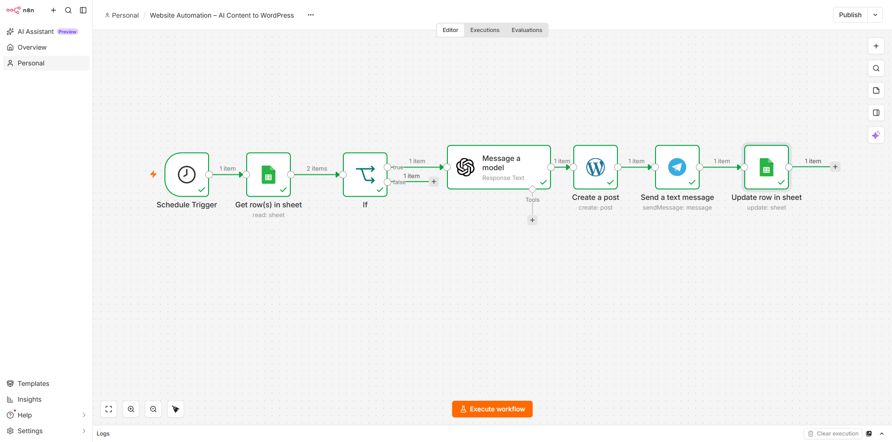
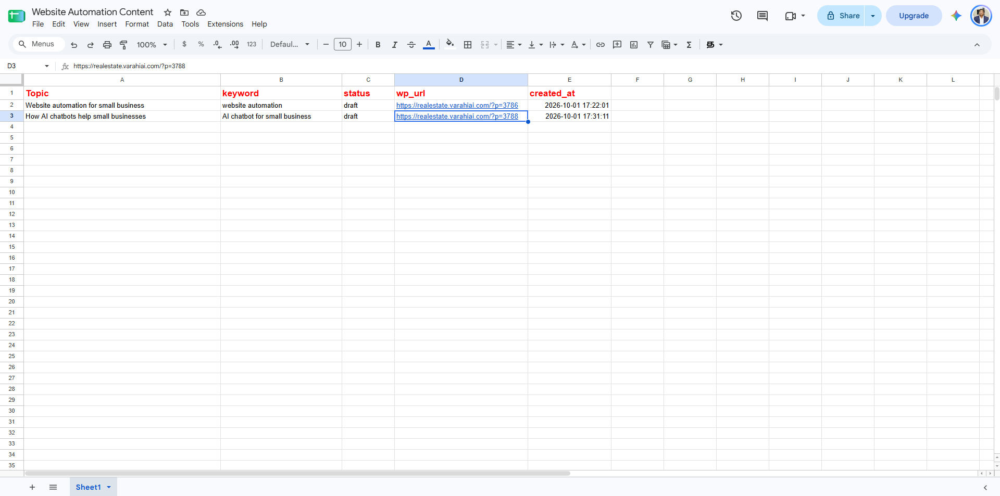
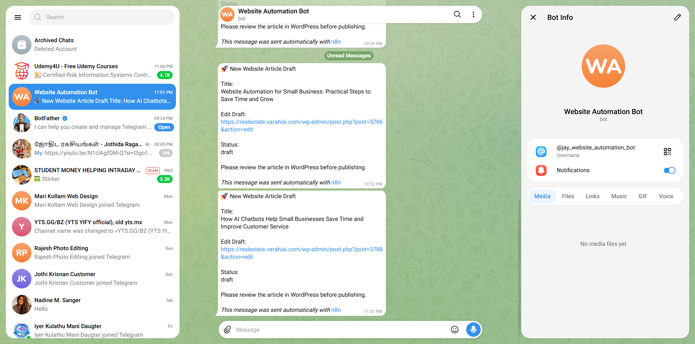
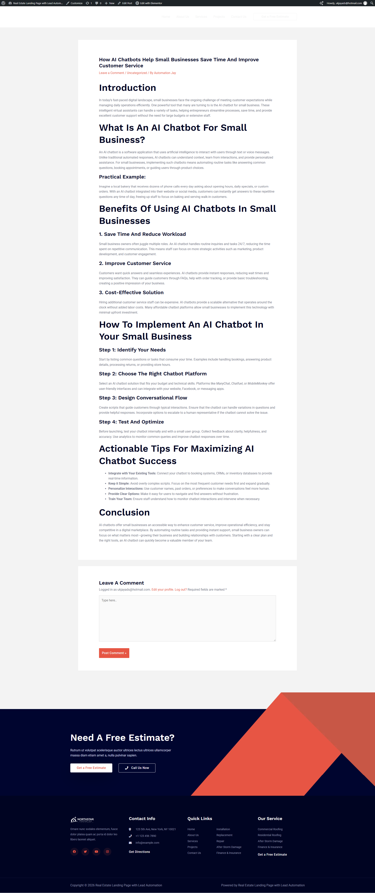

# Website Automation

A practical website automation project built with **n8n, WordPress, Google Sheets, AI, and Telegram**.

The workflow automatically takes a content topic from Google Sheets, generates an article with AI, creates a WordPress draft, sends the draft for review through Telegram, and updates the original Google Sheets row.

The goal is to reduce repetitive content-management tasks while keeping a human approval step before publication.

---

## What This Project Demonstrates

- AI-assisted website article generation
- Google Sheets as a content queue
- n8n workflow automation
- WordPress REST API integration
- Telegram draft notifications
- Automatic Google Sheets status updates
- Row-based workflow tracking
- Human approval before publication
- API-based integrations
- Error handling and retry concepts

---

## Tested Workflow

The main workflow has been tested end-to-end using a real WordPress website.

```text
Google Sheets
     ↓
Schedule Trigger
     ↓
Get Row(s)
     ↓
IF: status = Ready
     ↓
AI Content Generation
     ↓
Create WordPress Draft
     ↓
Send Telegram Notification
     ↓
Update Original Google Sheets Row
```

### Workflow Logic

1. A content topic is added to Google Sheets.
2. The row is marked `Ready`.
3. n8n runs on a schedule.
4. n8n retrieves the spreadsheet rows.
5. The IF node checks whether the status is `Ready`.
6. AI generates the article content and SEO metadata.
7. WordPress creates the article as a draft.
8. Telegram sends a notification containing the article title and WordPress Edit Draft link.
9. The original Google Sheets row is updated with:
   - Generated status
   - WordPress URL
   - Creation date
10. A human reviews the WordPress draft before publishing.

The human approval step is intentional: **AI prepares the content, while a human controls publication.**

### Workflow Architecture

```text
Google Sheets
     │
     ▼
Schedule Trigger
     │
     ▼
Get Row(s)
     │
     ▼
IF: Ready?
     │
     ▼
AI Content Generation
     │
     ▼
WordPress Draft
     │
     ▼
Telegram Notification
     │
     ▼
Google Sheets Update
```

### n8n Workflow



The workflow uses the following nodes:

- Schedule Trigger
- Get row(s) in sheet
- IF
- Message a model
- Create a post
- Send a text message
- Update row in sheet

---

## Google Sheets Content Queue



The Google Sheet acts as a simple content management queue.

### Example Fields

| Column | Purpose |
|---|---|
| Topic | Article topic |
| keyword | Primary keyword |
| status | Workflow status |
| wp_url | WordPress draft URL |
| created_at | Creation timestamp |

### Example Status Flow

```text
Ready
  ↓
AI generates article
  ↓
WordPress draft created
  ↓
Telegram notification sent
  ↓
status = draft
```

The workflow uses the original spreadsheet row number to update the correct row rather than creating a duplicate row.

---

## AI Content Generation

The AI node receives:

- Article topic
- Primary keyword
- Content requirements

It generates structured JSON containing:

```json
{
  "title": "Article title",
  "content": "<p>Article content...</p>",
  "meta_description": "SEO meta description",
  "slug": "article-url-slug"
}
```

The generated HTML content is then passed directly to WordPress.

---

## WordPress Integration

The WordPress node creates the article as a **draft** rather than publishing automatically.

This provides a review stage before the article becomes publicly available.

The workflow can therefore be used for:

- Blog content preparation
- SEO article drafts
- Website content production
- Agency workflows
- Client approval processes

---

## Telegram Notification



After WordPress creates the draft, n8n sends a Telegram notification containing:

- Article title
- WordPress Edit Draft link
- Draft status
- Review instruction

### Example

```text
🚀 New Website Article Draft

Title:
How AI Chatbots Help Small Businesses Save Time and Improve Customer Service

Edit Draft:
WordPress admin edit link

Status:
draft

Please review the article in WordPress before publishing.
```

---

## WordPress Result



The generated article is created successfully inside WordPress with:

- Title
- Headings
- Paragraphs
- Lists
- Structured article content

The post remains in **Draft** status until it is manually reviewed and published.

---

## Test Result

The complete workflow was tested successfully:

| Stage | Result |
|---|---|
| Google Sheets input | Passed |
| Schedule Trigger | Passed |
| Ready status check | Passed |
| AI article generation | Passed |
| WordPress draft creation | Passed |
| Telegram notification | Passed |
| Google Sheets update | Passed |
| WordPress article rendering | Passed |

---

## Repository Structure

```text
website-automation/
│
├── README.md
├── .gitignore
├── LICENSE
│
├── workflows/
│   ├── content-generation-template.json
│   ├── lead-capture-template.json
│   └── wordpress-publishing-template.json
│
├── prompts/
│   ├── article-generation.md
│   ├── seo-content.md
│   └── social-post.md
│
├── docs/
│   ├── architecture.md
│   └── setup.md
│
└── screenshots/
    ├── n8n-content-automation.png
    ├── google-sheets-result.png
    ├── telegram-draft-notification.png
    └── wordpress-draft.png
```

---

## Example Use Cases

This workflow can be adapted for:

- Automated WordPress blog preparation
- SEO content generation
- Website content pipelines
- Agency content production
- Client approval workflows
- Scheduled content creation
- AI-assisted publishing workflows
- Content tracking in Google Sheets

---

## Tech Stack

- n8n
- WordPress
- Google Sheets
- Telegram
- AI APIs
- REST APIs
- Webhooks
- JavaScript

---

## Important Security Notes

The workflow templates in this repository should **never contain real credentials or secrets**.

Before using the templates, configure your own:

- n8n credentials
- WordPress credentials
- Google Sheets credentials
- Telegram bot credentials
- AI provider credentials
- Webhook URLs

Never commit:

- API keys
- Passwords
- Access tokens
- Cookies
- WordPress application passwords
- `.env` files
- Private credentials

---

## Author

**Jay**

Web Developer & AI Automation Specialist

Website: https://varahiai.com/

GitHub: https://github.com/JAY21121967

---

## Disclaimer

This repository contains reusable examples and workflow templates.

Review every workflow, credential, API permission, and automation step before deploying it in a production environment.
